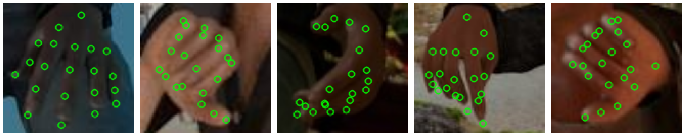

# Hand Joint Recognition

Recognizing hand joints in images.



## Installation

```shell
# create a Python virtualenv
. env.sh
# install Python requirements and setup paths
make install
```

Requires Python 3.6.1. You will be prompted to provide a path to an experiment directory (training and prediction outputs ) and a data directory (dataset and pre-trained weights). Create them wherever you wish and make sure to provide their absolute paths.

## Reproducing our results

### Dataset

You should have the two files `training.h5` and `testing.h5` in your data directory.

### Pre-trained weights

The encoder is initialized with weights trained on ImageNet and available [here](https://github.com/tensorflow/models/tree/master/research/slim#pre-trained-models).

```b
cd <DATA_DIR> && mkdir resnet_v2_152 && cd resnet_v2_152
wget http://download.tensorflow.org/models/resnet_v2_152_2017_04_14.tar.gz 
tar -xzf resnet_v2_152_2017_04_14.tar.gz
```

### Training

Our top-scoring model can be trained as follow:

```b
cd jointrecog
python experiment.py train config/resnet_fc.yaml resnet_fc
```
The training can be interrupted at any time using `Ctrl+C` and the weights will be saved in `<EXPER_DIR>/resnet_fc/`. This folder also contains the Tensorboard summaries. If your machine has <90GB RAM you will need to disable caching by setting `cache_in_memory` to `false` in `config/resnet_fc.yaml`. Training for 120k iterations (the default) takes approximately 6 hours on our machine.

### Predictions

```b
python export_for_kaggle.py config/resnet_fc.yaml resnet_fc --augment
```
The csv prediction file will be saved as `<EXPER_DIR>/resnet_fc.csv`.
